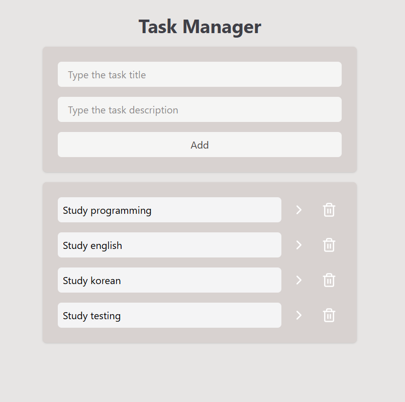
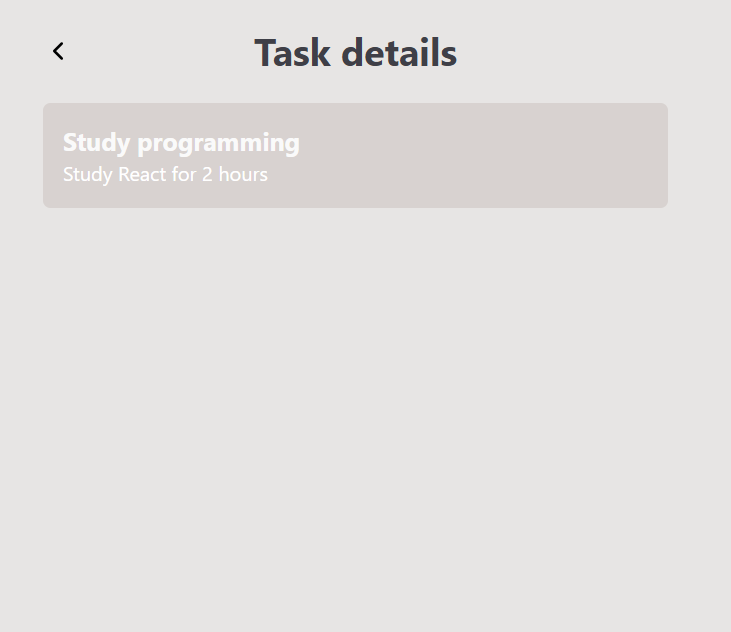

# Task Manager

A simple task management application developed with React

## About

Task Manager is a web application that allows users to create, complete, delete and view details of their tasks.

This application was developed while following a React course from the YouTube channel "Felipe Rocha - FullStack Club", in which the project was built step by step as part of the learning process. I also made additional changes and customizations based on my own requirements.

The objective was to develop and practice fundamental React concepts including components, props, state management, hooks and routing.

## Features

- Add new tasks
- Mark tasks as completed
- Delete tasks
- View task details
- Navigate between pages
- Store tasks in the browser using Local Storage

## Technologies

This project was developed using:

- React
- JavaScript
- Vite
- React Router DOM
- Tailwind CSS
- Lucide React
- UUID

## Getting started

Follow the steps below to run the project locally.

### Prerequisites

Before starting, make sure you have the following installed:

- Node.js
- Git

### Step 1: Clone the repository

In your using terminal, run the commands:

```bash
git clone https://github.com/rachelwitchburn/task-manager.git
```

### Step 2: Navigate to the project directory

```bash
cd task-manager
```

### Step 3: Install dependencies

```bash
npm install
```

### Step 4: Start the development server

```bash
npm run dev
```

The terminal will display the local address where the application is running.
Open it in your browser.

## Project Structure

src/
├── components/
│ ├── AddTask.jsx
│ └── Tasks.jsx
├── pages/
│ └── TaskPage.jsx
├── App.jsx
├── index.css
└── main.jsx

- `components/` - Reusable components used by the application.
- `pages/` - Components representing application pages.
- `App.jsx` - Main application component and route definitions.
- `main.jsx` - Application entry point and router configuration.
- `index.css` - Global styles.

## Routes

| Route   | Description                        |
| ------- | ---------------------------------- |
| `/`     | Displays the task manager          |
| `/task` | Displays the selected task details |

## Data persistence

Tasks are stored in the browser's Local Storage.

This allows tasks to remain available even after refreshing or closing
the application.

## Screenshots

### Home



### Task Details


